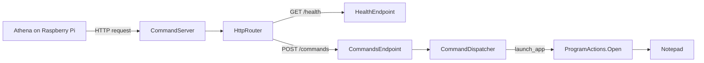

# Athena Desktop

Athena Desktop is the Windows desktop client for Athena, written in C#.

## Architecture

Athena runs on the Raspberry Pi and handles voice transcription and command routing. The desktop client receives structured commands from Athena and executes supported Windows actions.

- **Athena:** Decides what action to perform and which backend should handle it.
- **Athena Desktop:** Executes supported PC actions and returns their results.
- **Home Assistant:** Handles smart-home actions separately from the desktop client.

The initial focus is deterministic commands. LLM fallback is a later Athena feature and is not required for desktop control.

The HTTP implementation separates listener lifecycle, routing, and endpoint behavior:

- `src/server/CommandServer.cs` accepts HTTP requests, delegates to the router, and closes responses.
- `src/server/HttpRouter.cs` matches URL paths and returns 404 for unknown routes.
- `src/server/endpoints/` contains endpoint classes that define their paths, validate methods, and handle requests.
- `src/dispatch/CommandDispatcher.cs` maps command names to action handlers and returns command results.
- `src/actions/ProgramActions.cs` resolves supported application names and starts their executables.
- `src/Program.cs` registers endpoints with the router, connects the dispatcher, and configures the server.

To add an endpoint, implement `IHttpEndpoint` in the endpoints directory and register it in `Program.cs`.

## Current Progress

The desktop supports HTTP health checks and application launching through `POST /commands`. The first supported application is Notepad. The complete Pi-to-desktop flow has been tested: an HTTP command reaches the dispatcher, launches Notepad, and returns a result.

Closing, minimizing, focusing, and arranging application windows are future actions and are not implemented yet.



## Development

The client targets .NET 10. Build and run with:

```powershell
dotnet build src/Athena.Desktop.csproj
dotnet run --project src/Athena.Desktop.csproj
```

The server listens on `http://localhost:5000/` by default and accepts `POST /commands`:

```json
{
  "requestId": "example-1",
  "command": "launch_app",
  "parameters": { "name": "notepad" }
}
```

When the launch succeeds, the server returns HTTP 200:

```json
{
  "requestId": "example-1",
  "success": true,
  "message": "Launch requested for 'notepad'."
}
```

Malformed JSON or a missing command returns HTTP 400. Dispatched commands return HTTP 200 with a `success` flag: unsupported commands, unknown applications, invalid application parameters, and launch failures return `success: false` with an explanatory message. Responses preserve the request ID. Unknown routes return HTTP 404; unsupported methods return HTTP 405 with an `Allow` header. Requests are processed sequentially.

The dispatcher is connected through the `CommandsEndpoint` constructor in `Program.cs`. An endpoint constructed without a handler still returns HTTP 501 for valid commands. Add application mappings in `ProgramActions` and register new action handlers in `CommandDispatcher`.

Use `GET /health` to check that the HTTP server is responding:

```powershell
Invoke-RestMethod http://localhost:5000/health
```

It returns HTTP 200 with `{"status":"ok"}` without executing a command. Other methods return HTTP 405. To test from the Pi, run `curl http://192.168.68.138:5000/health`, replacing the address with your desktop's configured LAN IP.

For Pi access, set `ATHENA_BIND_HOST` to your desktop's LAN IP before starting the process:

```powershell
$env:ATHENA_BIND_HOST = "192.168.68.138"
dotnet run --project src/Athena.Desktop.csproj
```

This listens on `http://192.168.68.138:5000/`. If `ATHENA_BIND_HOST` is unset or blank, the host defaults to `localhost`. To persist the IP for future terminal sessions, use `[Environment]::SetEnvironmentVariable("ATHENA_BIND_HOST", "192.168.68.138", "User")`, then restart your terminal or IDE.

`ATHENA_HTTP_PREFIX` remains available for a complete URL override, including a custom port, such as `http://192.168.68.138:5001/`. A nonblank `ATHENA_HTTP_PREFIX` takes precedence over `ATHENA_BIND_HOST` and must include a trailing slash.

Windows may require an HTTP URL reservation and an inbound firewall rule for that address and port. The scaffold has no authentication; use it only on a trusted development network. Ctrl-C stops the listener.

## Related Repository

- [Athena](https://github.com/b-stha/athena): Raspberry Pi assistant and command router.
